### Lab 12A

Publishing and Sharing Power BI Content

# Overview

**The estimated time to complete the lab is 45 minutes**

In this lab, you will work in pairs with a classroom partner to explore the three core methods for sharing Power BI content.

In this lab, you learn how to:

* Map security principals to dataset roles

* Share a dashboard

* Publish an app

# Exercise 1: Configure Dataset Security

In this exercise, you will assign your classroom partner’s account to the **Salespeople** role of your dataset.

### Task 1: Configure dataset security

In this task, you will assign your classroom partner’s account to the **Salespeople** role of your dataset.

1. In Edge, in the Power BI service, in the **Navigation** pane, hover the cursor over the **Sales Analysis** dataset, click the vertical ellipsis (…), and then select **Security**.

	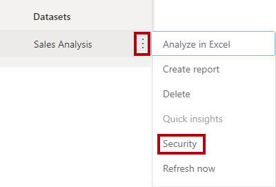

2. In the **Row-Level Security** page, at the left, notice that the **Salespeople** role is selected.

3. In the **Members** box, commence typing the account name of your classroom partner—when it is listed, select it.

	*Adding individual accounts is time consuming and requires a lot of maintenance. Consider that the Adventure Works company would likely have a security group that contains all salespeople accounts. This security group would be the only security principal mapped to the role*.

4. Click **Add**.

	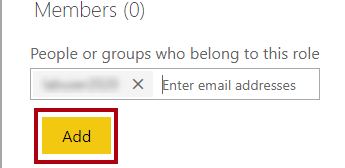

5. At the bottom of the page, click **Save**.

	

	*The account of your classroom partner is now mapped to the **Salespeople** role. Recall that their account is for the salesperson Pamela Ansam-Wolfe, whose sales performance is measured by the sales of two sales territory regions: US Northwest and US Southwest*.

# Exercise 2: Share a Dashboard

In this exercise, you will share your **Sales Monitoring** dashboard with your classroom partner (and they will share theirs with you).

### Task 1: Share a dashboard

In this task, you will each share a dashboard, and then open the shared dashboard shared with you.

*With your classroom partner, work through all task steps together, on each of your computers*.

1. Open the **Sales Monitoring** dashboard.

7. On the menu bar, click **Share**.

	

8. In the **Share Dashboard** pane (located at the right), in the **Grant Access To** box, commence typing the account name of your classroom partner—when it is listed, select it.

9. Review the available options—but do not change them.

10. At the bottom of the pane, click **Share**.

	

### Task 2: Open the shared dashboard

In this task, you will each open the dashboard shared with you.

1. In the **Navigation** pane, click **Shared With Me**.

	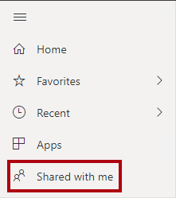

12. Notice that the **Sales Monitoring** dashboard is listed.

	

13. To open the dashboard, click the **Sales Monitoring** dashboard.

14. Notice that the dashboard **Sales YTD** tile value is **$13M**.

	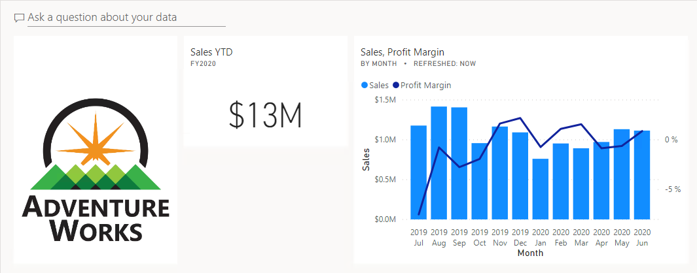

	*The **Sales YTD** tile displays a value for US Northwest and US Southwest regions only*.

	*Sharing dashboards (and reports) is easily achieved and managed by the content owner. Power BI provides a read-only experience to recipients. If the owner enables re-sharing, recipients can share the content with others*.

	*This approach should be reserved for ad hoc sharing requirements. If you need to share many Power BI items, then publishing an app is a better option. You’ll publish your Sales Analysis workspace as an app in the next exercise*.

# Exercise 3: Publish an App

In this exercise, you will publish the contents of your **Sales Analysis** workspace, and then “get” the app published by your classroom partner.

### Task 1: Publish an app

In this task, you will publish the contents of your **Sales Analysis** workspace, and then “get” the app published by your classroom partner.

1. In the **Navigation** pane, open your **Sales Analysis** workspace.

16. In the **Navigation** pane, click the name of the workspace.

	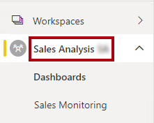

17. At the top-right, click **Publish App**.

	

18. Notice that the publish app process requires configuration in three tabs: **Setup**, **Navigation**, and **Permissions**.

	

19. In the **Description** box, enter: **Sales analysis and exploration**

	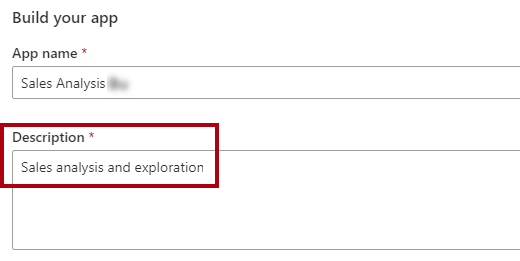

20. For the **App Logo**, click **Upload**.

	Picture 91](Linked_image_Files/PowerBI_Lab12A_image13.png)

21. In the **Open** window, navigate to the **D:\DA100\Lab12A\Assets\Icons** folder.

22. Select one of the JPG files, and then click **Open**.

23. For the **App Theme Color**, select any color.

24. Select the **Navigation** tab.

	

25. In the **Navigation** section, notice the workspace content that will be published.

	*It is possible to set the order of the workspace content, and also add sections and links. Sections are a single-level grouping of content (similar to a folder). Links are a link to any valid web page. You won’t modify the navigation setup in this lab*.

26. Select the **Permissions** tab.

	

27. In the **Specific Individuals or Groups** box, commence typing the account name of your classroom partner—when it is listed, select it.

	*The **Entire Organization** option may be disabled if the tenant admin has restricted it. In this case, the **Install this App Automatically** option will also be disabled. If enabled, the app could be pushed to all users. You will learn how to “get” the app in the next task*.

28. At the bottom-right corner, click **Publish App**.

	

29. When prompted to publish the app, click **Publish**.

	

30. When notified that the app was successfully published, click **Close**.

	

### Task 2: Get the app

In this task, you will “get” the app, and explore the app contents.

1. In the **Navigation** pane, click **Apps**.

	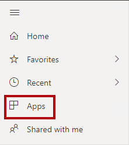

32. In the middle of page, click **Get Apps**.

	

33. In the AppSource window, for the **Sales Analysis** app published by your classroom partner, click the **Get it Now** link.

	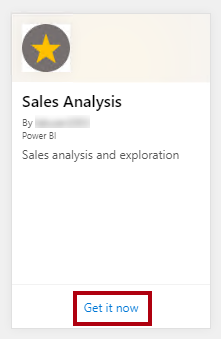

34. When the app is added, to open the app, click the app tile.

	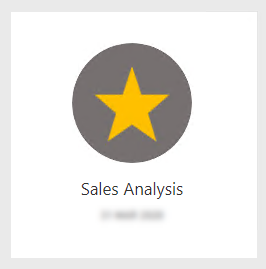

35. When the app opens, review the navigation pane (located at the left).

36. Notice that the first item in the navigation pane has opened.

37. In the navigation pane, expand **Sales Report**, and then select the **Overview** page.

 	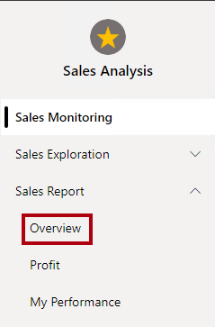

38. Notice that **Region** slicer only displays two regions—the regions assigned to Pamela Ansam-Wolfe.

	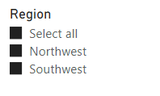

39. Select the **My Performance** page.

40. Notice that the page displays the sales and targets for Pamela Ansam-Wolfe.

41. Open the **Sales Exploration** report, and then interact with the visuals on each page.
